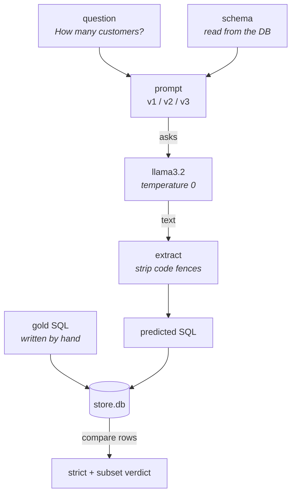

# Inside evalkit

Every file in the repo, what it does, and why it exists — starting from the one
idea the whole thing is built on.

---

## The one big idea

You ask a model to write SQL. It writes something. Is it right? You squint at
it, it looks fine, you move on. Then you change your prompt and… is it better
now? You have no idea. That's the problem this whole project solves.

> **Think of a spelling test.** The model is the student. You need an answer
> key, and you need a red pen.
>
> But SQL has a twist: **two students can write completely different answers and
> both be right.** `WHERE age > 30` and `WHERE 30 < age` are the same question
> asked two ways. So you can't mark by comparing handwriting.
>
> Instead you mark by **checking the answer**. Run both queries on the real
> database. Same rows come back? Correct. That's it. That's the trick the entire
> repo is built around, and it has a name: **execution accuracy**.

Everything else — the files, the metrics, the tests — exists to make that one
comparison trustworthy.

---

## What happens when you press run



The model never touches the grading. It produces one query; that query and the
hand-written gold query are run against the same database, and only the returned
rows are compared.

1. **Read the schema from the database.** Not typed into the prompt by hand —
   pulled live from `store.db`, so it can never drift out of sync with the
   database the queries actually run on.
2. **Fill in the prompt template.** Each file in `prompts/` has `{schema}` and
   `{question}` holes. Fill the holes, get a prompt.
3. **Ask the model.** Running locally through Ollama. Temperature 0, which
   means: ask the same thing twice, get the same answer twice.
4. **Dig the SQL out of the reply.** Models like to wrap answers in ` ```sql `
   fences and a paragraph of chat. We strip that off — it's a formatting habit,
   not a wrong answer.
5. **Run both queries.** The model's query and your hand-written one, on the
   same database.
6. **Compare the rows.** Match → correct. That's the verdict.
7. **Save everything and rank.** Every query and verdict goes to a CSV, and the
   prompts get ranked on a leaderboard.

---

## File by file

### `db/build_db.py` — the pretend shop

Builds a tiny SQLite database: customers, products, orders, and the line items
linking orders to products. Seven customers. Six products. That's on purpose —
**small enough that you can check every answer in your head.** If the database
were huge, you couldn't tell whether a weird answer was the model's fault or
yours.

Two rows in it exist purely to make questions answerable: Grace Lund has *no*
orders, and Atlanta has more customers than anywhere else. More on why below.

### `data/golden.jsonl` — the answer key

Eleven questions. For each one: the question in English, the correct SQL written
**by hand**, and a flag saying whether row order matters.

```json
{"id": 2,
 "question": "List the names of all customers in Atlanta.",
 "gold_sql": "SELECT name FROM customers WHERE city = 'Atlanta'",
 "order_matters": false}
```

That `order_matters` flag is doing quiet, important work. "List customers in
Atlanta" — any order is fine. "List cities, most customers first" — the order
*is* the answer. Get this wrong and you fail correct queries.

This file is the slowest, least glamorous part of the project, and it is the
part that makes the rest mean anything.

### `db/verify_golden.py` — who checks the answer key?

Runs every gold query and prints what comes back, **before any model is
involved**. Because here's the thing nobody warns you about: *a wrong answer key
is worse than no answer key.* It silently caps your score, and you'll spend the
afternoon blaming the model for your own mistake.

On the very first run it caught two bugs in my own answer key — both described
below.

### `prompts/*.txt` — the three contestants

Three ways of asking the same thing. **v1** just asks for SQL. **v2** adds the
database schema. **v3** adds the schema plus strict rules plus a worked example.

Any sensible person would bet on v3. Hold that thought.

### `run_eval.py` — the exam room

Loops every prompt over every question, calls the model, extracts the SQL, sends
it to the scorer, writes a CSV, prints the leaderboard. It's the conductor — it
doesn't decide anything itself, it just moves things between the other files.

One line in here matters more than it looks:

```python
options={"temperature": 0}
```

Temperature is the model's randomness dial. Turned up, the same question gives
different answers each run — so your score wobbles, and you can't tell a real
improvement from luck. Turned to 0, a score change means *you* changed
something.

### `score.py` — the red pen

The heart of the project. Runs both queries, compares the rows, returns a
verdict. Three rules keep it honest:

- **A crash is wrong.** If the model invents a column that doesn't exist, that's
  a failure — no partial credit.
- **Empty never counts as a match.** Even if the gold answer is also empty. A
  model that returns nothing shouldn't be rewarded for it.
- **`4` and `4.0` are the same number.** This one bit me — see below.

### `test_score.py` — who grades the grader?

Fourteen tests where *you already know the right verdict*, so you can check the
red pen itself. Does "same answer, different SQL" pass? Does "right rows, wrong
order, when order matters" fail?

This is the step people skip. If your grader is broken, every number it produces
is fiction — and you won't find out from the numbers, because they'll look
perfectly reasonable.

### `rescore.py` — re-mark without re-testing

Re-grades the saved CSVs without calling the model again. Sounds like a small
convenience. It isn't.

The scorer keeps changing as you find its blind spots. If fixing the scorer
meant re-running the model, every fix would take another minute *and* the model
might answer slightly differently — so you couldn't tell whether the numbers
moved because of your fix or because of the model. **Keeping generation and
grading separate means a scorer change is the only thing that changed.**

---

## The prompt everyone would bet on came last

Same model, same eleven questions, temperature 0:

| Prompt | Strict | Subset | Gap |
|---|---:|---:|---:|
| v2 — schema only | 55% | 91% | +4 |
| v1 — no schema | 18% | 36% | +2 |
| v3 — schema + rules + example | 18% | 36% | +2 |

**v3 tied with the worst prompt.** Its worked example was formatted in a style
that nudged the model into inventing table nicknames — `T1`, `T2`, `T3` — that
don't exist in the database. The example meant to help was the thing doing the
damage. Nobody would have guessed that. The harness found it in 12 seconds.

### Why there are two numbers

Ask "what's the most expensive product?" and the model replies:

```
wanted:  ('Espresso Machine',)
got:     ('Espresso Machine', 499.0)
```

Is that wrong? **Strict** says yes — the table doesn't match. **Subset** says it
contains the right answer with a spare column stuck on, so count it.

Both readings are useful, and the space between them is the actual diagnosis:

> **v2 scores 55% strict and 91% subset.** So four of its five failures were
> correct answers formatted badly, and exactly *one* was a real mistake.
>
> That changes what you'd do next. At 55% you go rewrite the prompt's reasoning
> guidance — days of work. At "91% with a formatting gap" you add one sentence
> about returning only the requested columns, and you're nearly done.
>
> **A single accuracy number hides which of those two situations you're in.**

---

## Three bugs, and none of them were the model's

### 1. A question nobody could fail

"List customers who have never placed an order." Correct answer: *nothing*.
Every customer in the database happened to have an order. A model returning
total garbage could accidentally match an empty result.

**Caught by** `verify_golden.py`, before a single model call.
**Fix:** added Grace Lund, who orders nothing.

### 2. A coin flip disguised as a test

"List cities, most customers first" — and two cities were tied. So the "correct"
order was whatever SQLite happened to feel like. A perfectly correct model would
fail this question at random, and you'd never work out why.

**Fix:** moved one customer so no two cities tie.
**Lesson:** if a question has more than one right answer, it isn't a test yet.

### 3. The grader was wrong, not the model

I was comparing cells as text. SQLite's `COUNT` returns `4` and `SUM` returns
`4.0`. As text, `"4"` ≠ `"4.0"` — so a completely correct query was being marked
FAIL over a type detail nobody asked about.

**Found by** reading IBM's
[text2sql-eval-toolkit](https://github.com/IBM/text2sql-eval-toolkit) and
noticing they normalize every value before comparing.
**Lesson:** when your numbers look bad, suspect your ruler before you suspect
the thing you're measuring.

---

## Four things to try, in order

**1. Watch it work.** Change nothing, just look. The `~sub` marks are the
near-misses.

```bash
./venv/bin/python run_eval.py v2_schema
```

**2. Close the gap.** Copy `v2_schema.txt` to `v4_columns.txt` and add one line:
*return only the columns the question asks for, nothing extra.* Run it. If the
theory holds, strict should jump toward 90% and the gap should shrink toward
zero.

```bash
./venv/bin/python run_eval.py v4
```

**3. Break the grader on purpose.** Open `score.py` and delete the `canonical()`
call inside `normalize()`. Run the tests. Watch the `4` vs `4.0` test go red —
that's the bug from war story 3, live. Then put it back.

```bash
./venv/bin/python test_score.py
```

**4. Add the twelfth question.** Write one you think the model will get wrong,
add it to `golden.jsonl` with hand-written SQL, verify it, then run. Predict the
verdict before you look. **Being wrong about your prediction is the whole point
of the exercise** — that gap between what you expected and what happened is
exactly what the harness exists to show you.

Q11 was added exactly this way: *"which customer has spent the most money?"* —
three joins, a `SUM`, and only $5.50 between first and second place. The model
got every hard part right and still scored zero on strict, because it appended
the total:

```
wanted:  ('Farah Haddad',)
got:     ('Farah Haddad', 648.5)
```

Adding it dropped strict from 60% to 55% and nudged subset from 90% to 91%. The
model didn't get worse — the new question was just one more chance to format
wrong. That's the trap a single number walks you into.

```bash
./venv/bin/python db/verify_golden.py
```
